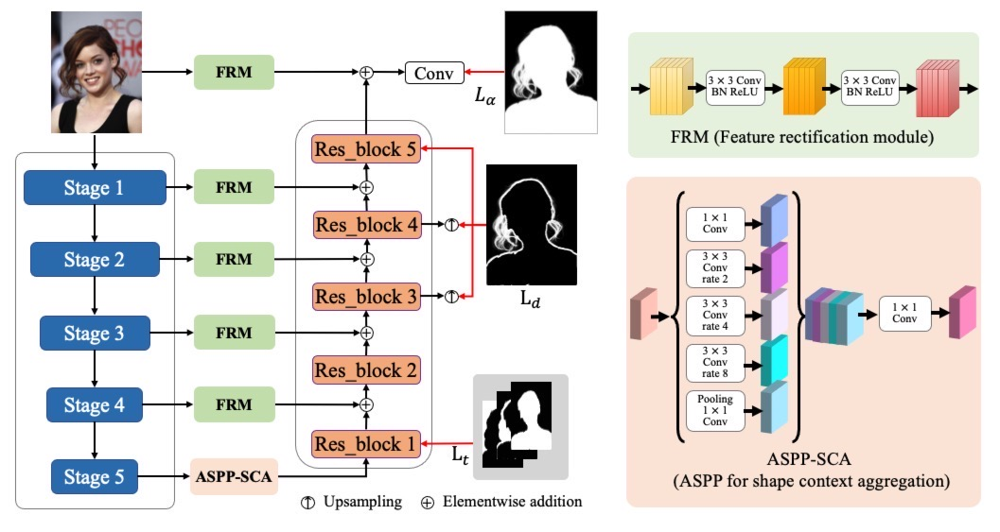
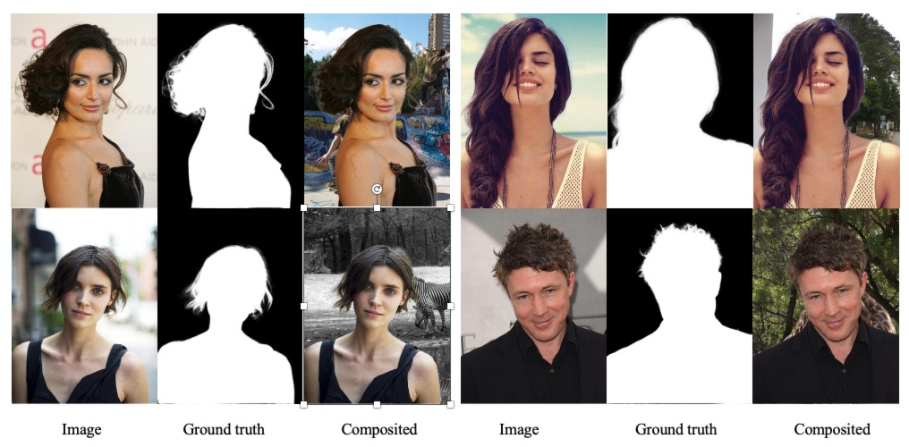
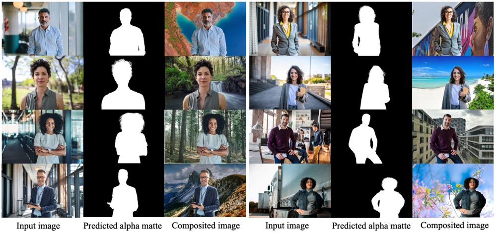

# MTGINet

## Introduction

<center>Multi-task Gradual Inference with A Single Encoder-Decoder Network for Automatic Portrait Matting</center>

​    We presents a multitask gradual inference model for automatic portrait matting, termed MTGINet. MTGINet handles the subtasks with a single encoder-decoder structure. For trimap segmentation, we enrich the highest stage of features from the encoder with portrait shape context via a shape context aggregation (SCA) module for trimap segmentation. Then we fuse the SCA-enhanced features with detail clues from the encoder for transition-region-aware alpha matting. The multi-task gradual inference naturally allows sufficient interaction between the subtasks via forward computation and backward propagation during training, and therefore helps boost performance in accuracy while keeping low complexity. Considering the discrepancies in feature requirements across the subtasks, we adapt the features from the encoders before re-using them via a feature rectification module (FRM).



### Dependencies

```
Python >= 3.7
PyTorch >= 1.7
```

## Dataset

​    We construct a portrait matting dataset, termed HPM-17K, which contains 17K images and their ground-truth alpha mattes. The dataset can be downloaded from [Baidu Netdisk](https://pan.baidu.com/s/16X8cwtKzxoYKZrxIouI9hw?pwd=45v9)(pw: 45v9)

## Training

​     If you want to train MTGINet, you can use the following command，and we provide pre-training weights from here([Google link]() | [Baidu Netdisk](https://pan.baidu.com/s/1F3sohx6h_NiEXBcLcZ1Keg?pwd=xnwi)(pw:xnwi))

```bash
./train.sh
```

​    We have also organized the evaluation code, which originally comes from Xu's “Deep Image Matting”, but it was written in MATLAB. We have converted it into PYTHON. The code is [https://github.com/yangwenbing2/evaluation_code](https://github.com/yangwenbing2/evaluation_code).

## Results

​    We test our network on our proposed HPM-17K  and compare with previous SOTA methods, we list the results as below.



​    We tested our network in real-world scenarios at the same time，the result are showed below, where all test images are from the getty images website.



## Citation

If this work helps your research, please consider to cite:

```
```


